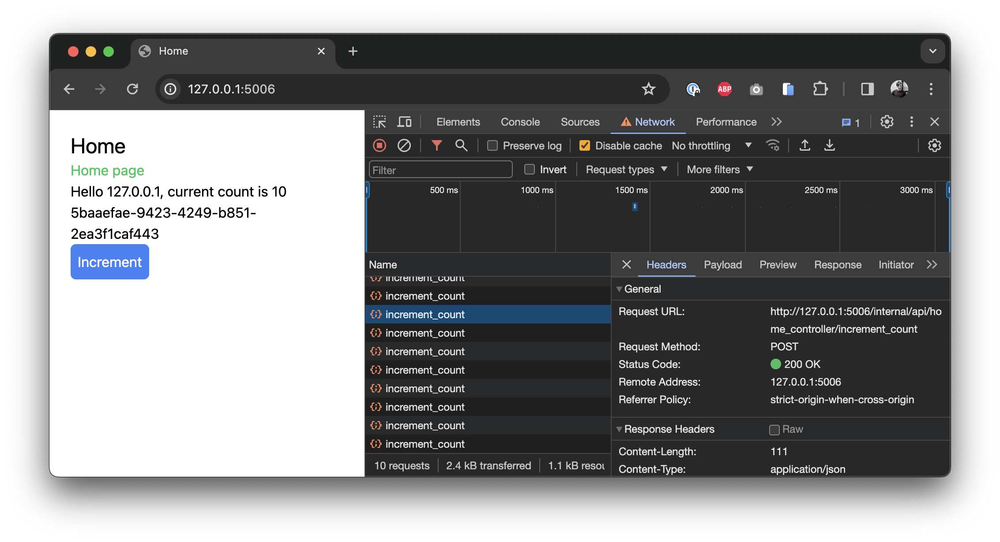

<p align="center"><i>Move fast. Climb mountains. Don't break things.</i></p>

Mountaineer 🏔️ is a framework to easily build webapps in Python and React. If you've used either of these languages before for development, we think you'll be right at home.

## Main Features

Each framework has its own unique features and tradeoffs. Mountaineer focuses on developer productivity above all else, with production speed a close second.

- 📝 Typehints up and down the stack: frontend, backend, and database
- 🎙️ Trivially easy client<->server communication, data binding, and function calling
- 🌎 Optimized server rendering for better accessibility and SEO
- 🏹 Static analysis of web pages for strong validation: link validity, data access, etc.
- 🤩 Skip the API or Node.js server just to serve frontend clients

## Getting Started

### New Project

To get started as quickly as possible, we bundle a project generator that sets up a simple project after a quick Q&A.

```bash
$ pipx run create-mountaineer-app new

? Project name [my-project]: my_website
? Use poetry for dependency management? [Yes] Yes
? Author [Pierce Freeman <pierce@freeman.vc>] Default
? Use Tailwind CSS? [Yes] Yes
```

Mountaineer projects all follow a similar structure. After running this CLI you should see a new folder called `my_website`, with folders like the following:

```
my_website
  /controllers
    /home.py
  /views
    /app
      /home
        /page.tsx
      /layout.tsx
    /package.json
    /tsconfig.json
pyproject.toml
poetry.lock
```

Every service file is nested under the `my_website` root package. Views are defined in a disk-based hierarchy (`views`) where nested routes are in nested folders. This folder acts as your React project and is where you can define requirements and build parameters in `package.json` and `tsconfig.json`. Controllers are defined nearby in a flat folder (`controllers`) where each route is a separate file.

### Development

While doing development work, you'll usually want to preview the frontend and automatically build dependent files. You can do this with:

```bash
$ poetry run runserver
```

Or, if you just want to watch the source tree for changes without hosting the server:

```bash
$ poetry run watch
```

### Walkthrough

Below we go through some of the unique aspects of mountaineer. Let's get started with creating a new controller, since this will define which data you can push and pull to your frontend.

```python title="my_website/controllers/home.py"
from mountaineer.actions import sideeffect
from mountaineer.controller import ControllerBase
from mountaineer.render import RenderBase
from fastapi import Request

class HomeRender(RenderBase):
    client_ip: str
    current_count: int

class HomeController(ControllerBase):
    url = "/"
    view_path = "/app/home/page.tsx"

    def __init__(self):
        super().__init__()
        self.global_count = 0

    def render(self, request: Request) -> HomeRender:
        return HomeRender(
            client_ip=(
                request.client.host
                if request.client
                else "unknown"
            ),
            current_count=self.global_count,
        )
```

The only three requirements of a controller are setting the:

- URL
- View path
- Initial data payload

This particular controller manages a counter that we want to persist across page loads. We keep it in memory attached to an instance of the class. It will therefore reset when the current webserver process ends. You could imagine we could also persist it to a database via some simple SQL queries, or an ORM like SqlAlchemy. For this walkthrough, database persistence is out of scope.

The client here doesn't need much data so we keep the `HomeRender` model simple, just sending the current count and client IP address. The data from `render()` is injected into the frontend as we'll see in a minute. This render() function accepts all parameters that FastAPI endpoints do: paths, query parameters, and dependency injected functions. Right now we're just grabbing the `Request` object to get the client IP.

Let's move over to the frontend.

```tsx title="my_website/views/home/page.tsx"
import React from "react";
import { useServer } from "./_server/useServer";

const Home = () => {
  const serverState = useServer();

  return (
    <div>
      <p>
        Hello {serverState.client_ip}, current count is
        {" "}{serverState.current_count}
      </p>
    </div>
  );
};

export default Home;
```

We define a simple view to show the data coming from the backend. To accomplish this conventionally, we'd need to wire up an API layer, a Node server, or otherwise format the page with Jinja templates.

Here instead we use our automatically generated `useServer()` hook. This hook payload will provide all the `HomeRender` fields as properties of serverState. And it's available instantly on page load without any roundtrip fetches.

If you access this in your browser at `localhost:5006/` we can see the counter, but we can't really _do_ anything with it yet. Let's add some interactivity to increase the current count.

> [!TIP]
> Try disabling Javascript in your browser. The page will still render as-is with all variables intact, thanks to our server-side rendering.

```python title="my_website/controllers/home.py"
from pydantic import BaseModel

class IncrementCountRequest(BaseModel):
    count: int

class HomeController(ControllerBase):
    ...

    @sideeffect
    def increment_count(self, payload: IncrementCountRequest):
        self.global_count += payload.count
```

What good is a counter that doesn't count? We define a function that accepts a pydantic model, which defines an int increment. When clients provide this number we'll use this to update the global state.

The important part here is the `@sideeffect`. This decorator indicates that we want the frontend to refresh its data, since after we update the global count on the server the client state will be newly outdated.

Mountaineer detects the presence of this sideeffect function and analyzes its signature. It then exposes this to the frontend as a normal async function.

```tsx title="my_website/views/home/page.tsx"

import React from "react";
import { useServer } from "./_server/useServer";

const Home = () => {
  const serverState = useServer();

  return (
    <div>
      <p>
        Hello {serverState.client_ip}, current count is
        {" "}{serverState.current_count}
      </p>
      <button
        onClick={async () => {
          await serverState.increment_count({
            requestBody: {
              count: 1,
            },
          });
        }}
      >
        Increment
      </button>
    </div>
  );
};

export default Home;
```

We run this async handler when the button is clicked and specify our desired increment count. Notice that we don't have to read or parse the output value of this function. Since the function is marked as a sideeffect, the frontend will automatically refresh its data after the function is called.

Go ahead and load it in your browser. If you open up your web tools, you can increment the ticker and see POST requests sending data to the backend and receiving the current server state. The actual data updates and merging happens internally by mountaineer.



You can use these serverState variables anywhere you'd use dynamic React state variables. But unlike React state, these variables are automatically updated when a relevant sideeffect is triggered.

And that's it. We've just built a fully interactive web application without having to worry about an explicit API. You specify the data model and actions on the server and the appropriate frontend hooks are generated and updated automatically. It gives you the power of server rendered html and the interactivity of a virtual DOM, without having to compromise on complicated data mutations to keep everything in sync.

### Learn More

We have additional documentation that does more of a technical deep dive on different features of mountaineer. We order these roughly in the order that we anticipate you'll need them.

- [Client Actions](./docs/client_actions.md): Details on @sideeffect, @passthrough, and masking @sideeffect fields for partial re-rendering.
- [View Definition](./docs/view.md): How to define the view and use the serverState hook. Covers `page.tsx` and `layout.tsx` conventions to easily nest your site designs.
- [Page Metadata](./docs/metadata.md): How to set the title, description, and other metadata for your pages.
- [Link Generation](./docs/links.md): Generate links to other pages within your webapp, with typehinting and automatic URL generation.
- [Error Handling](./docs/error_handling.md): Conventions for handling client-side errors while fetching data in your webapp.
- [PostCSS](./docs/postcss.md): PostCSS build plugin for TailwindCSS support and other CSS processing.
- [Core Library](./docs/core_library.md): Details on how to do local development on the core library.

## Future Directions

- Offload more of the server logic to Rust
- AST parsing of the tsx files to determine which parts of the serverState they're actually using and mask accordingly
- Plugins for simple authentication, daemons, billing, etc.
