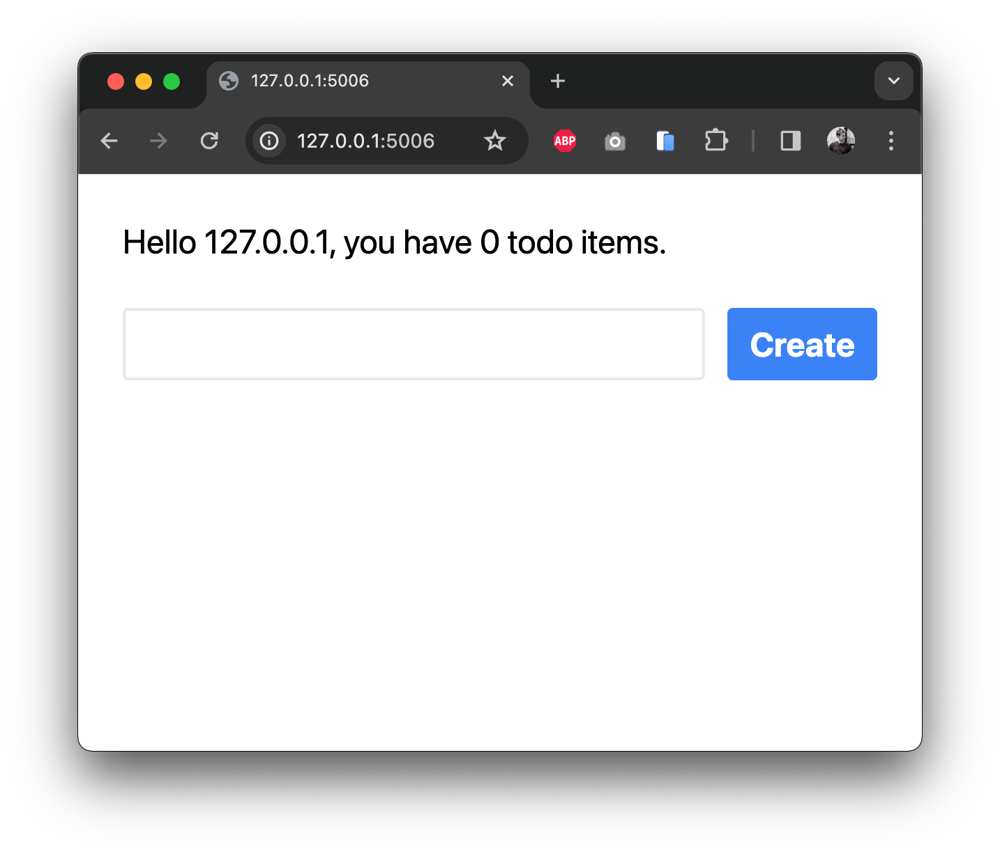
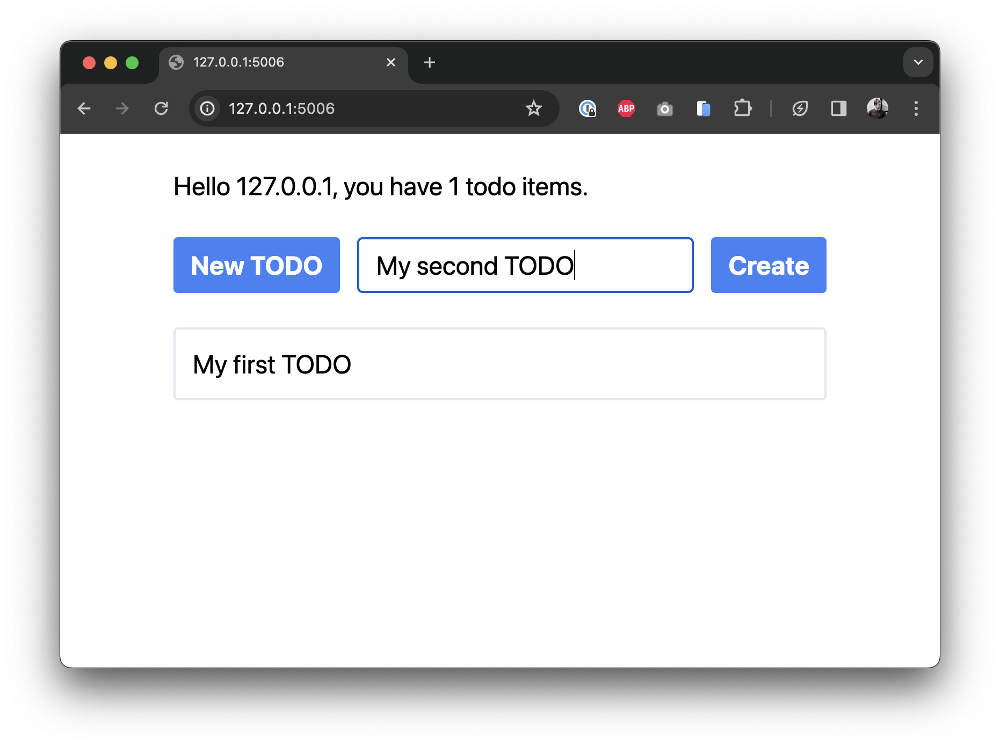
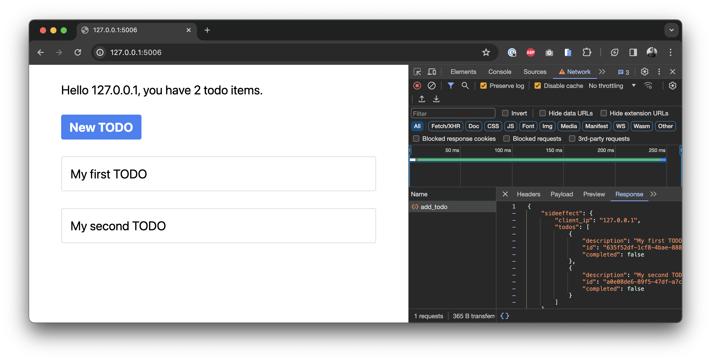

<p align="center"><i>Move fast. Climb mountains. Don't break things.</i></p>

Mountaineer 🏔️ is a framework to easily build webapps in Python and React. If you've used either of these languages before for development, we think you'll be right at home.

## Main Features

Each framework has its own unique features and tradeoffs. Mountaineer focuses on developer productivity above all else, with production speed a close second.

- 📝 Typehints up and down the stack: frontend, backend, and database
- 🎙️ Trivially easy client<->server communication, data binding, and function calling
- 🌎 Optimized server rendering for better accessibility and SEO
- 🏹 Static analysis of web pages for strong validation: link validity, data access, etc.
- 🤩 Skip the API or Node.js server just to serve frontend clients

> We built Mountaineer out of a frustration that we were reinventing the webapp wheel time and time again. We love Python for backend development and the interactivity of React for frontend UX. But they don't work seamlessly together without a fair amount of glue. So: we built the glue. While we were at it, we embedded a V8 engine to provide server-side rendering, added conventions for application configuration, built native Typescript integrations, and more. Our vision is for you to import one slim dependency and you're off to the races.
>
> We're eager for you to give Mountaineer a try, and equally devoted to making you successful if you like it. Especially while we're in the early days, I'm happy to hop on a text thread or call to help debug. Let me know.
>
> ~ Pierce

## Getting Started

### New Project

To get started as quickly as possible, we bundle a project generator that sets up a simple project after a quick Q&A.

```bash
$ pipx run create-mountaineer-app new

? Project name [my-project]: my_webapp
? Use poetry for dependency management? [Yes] Yes
? Author [Pierce Freeman <pierce@freeman.vc>] Default
? Use Tailwind CSS? [Yes] Yes
```

Mountaineer projects all follow a similar structure. After running this CLI you should see a new folder called `my_webapp`, with folders like the following:

```
my_webapp
  /controllers
    /home.py
  /models
    /mymodel.py
  /views
    /app
      /home
        /page.tsx
      /layout.tsx
    /package.json
    /tsconfig.json
  /app.py
  /cli.py
pyproject.toml
poetry.lock
```

Every service file is nested under the `my_webapp` root package. Views are defined in a disk-based hierarchy (`views`) where nested routes are in nested folders. This folder acts as your React project and is where you can define requirements and build parameters in `package.json` and `tsconfig.json`. Controllers are defined nearby in a flat folder (`controllers`) where each route is a separate file. Everything else is just standard Python code for you to modify as needed.

### Development

While doing development work, you'll usually want to preview the frontend and automatically build dependent files. You can do this with:

```bash
$ poetry run runserver
```

Or, if you just want to watch the source tree for changes without hosting the server:

```bash
$ poetry run watch
```

Both of these CLI commands are specified in your project's `cli.py` file.

### Walkthrough

Below we go through some of the unique aspects of Mountaineer. Let's create a simple Todo list where we can add new items.

Let's get started by creating the data models that will persist app state to the database. These definitions are effectively Pydantic schemas that will be bridged to the database via [SQLModel](https://github.com/tiangolo/sqlmodel).

```python filename="my_webapp/models/todo.py"
from mountaineer.database import SQLModel, Field
from uuid import UUID, uuid4

class TodoItem(SQLModel, table=True):
    id: UUID = Field(default_factory=uuid4, primary_key=True)

    description: str
    completed: bool = False
```

Update the index file as well:

```python filename="my_webapp/models/__init__.py"
from .todo import TodoItem # noqa: F401
```

Make sure you have a Postgres database running. We bundle a docker-compose file for convenience with `create-mountaineer-app`. Launch it in the background and create the new database tables from these code definitions:

```bash
docker-compose up -d
poetry run createdb
poetry run runserver
```

Great! At this point we have our database tables created and have a basic server running. We next move to creating a new controller, since this will define which data you can push and pull to your frontend.

```python filename="my_webapp/controllers/home.py"
from mountaineer import sideeffect, ControllerBase, RenderBase
from mountaineer.database import DatabaseDependencies

from fastapi import Request, Depends
from sqlalchemy.ext.asyncio import AsyncSession
from sqlmodel import select

from my_webapp.models.todo import TodoItem

class HomeRender(RenderBase):
    client_ip: str
    todos: list[TodoItem]

class HomeController(ControllerBase):
    url = "/"
    view_path = "/app/home/page.tsx"

    def __init__(self):
        super().__init__()

    async def render(
        self,
        request: Request,
        session: AsyncSession = Depends(DatabaseDependencies.get_db_session)
    ) -> HomeRender:
        todos = await session.execute(select(TodoItem))

        return HomeRender(
            client_ip=(
                request.client.host
                if request.client
                else "unknown"
            ),
            todos=todos.scalars().all()
        )
```

The only three requirements of a controller are setting the:

- URL
- View path
- Initial data payload

This `render()` function is a core building block of Mountaineer. All Controllers need to have one. It defines all the data that your frontend will need to resolve its view. This particular controller retrieves all Todo items from the database, alongside the user's current IP.

> [!TIP]
> render() functions accepts all parameters that FastAPI endpoints do: paths, query parameters, and dependency injected functions. Right now we're just grabbing the `Request` object to get the client IP.

Note that the database session is provided via dependency injection, which plug-and-plays with [FastAPI's](https://github.com/tiangolo/fastapi) Depends syntax. The standard library provides two main dependency providers:

- mountaineer.CoreDependencies: helper functions for configurations and general dependency injection
- mountaineer.database.DatabaseDependencies: helper functions for database lifecycle and management

Let's move over to the frontend.

```tsx filename="my_webapp/views/home/page.tsx"
import React from "react";
import { useServer, ServerState } from "./_server/useServer";

const CreateTodo = ({ serverState }: { serverState: ServerState }) => {
  return (
    <div className="flex gap-x-4">
      <button
        className="rounded bg-blue-500 px-4 py-2 font-bold text-white hover:bg-blue-700"
      >New TODO</button>
    </div>
  )
}

const Home = () => {
  const serverState = useServer();

  return (
    <div className="mx-auto max-w-2xl space-y-8 p-8 text-2xl">
      <p>
        Hello {serverState.client_ip}, you have {serverState.todos.length} todo items.
      </p>
      <CreateTodo serverState={serverState} />
      {
        /* Todo items are exposed as typehinted Typescript interfaces */
        serverState.todos.map((todo) => (
          <div key={todo.id} className="rounded border-2 border-gray-200 p-4">
            <div>{todo.description}</div>
          </div>
        ))
      }
    </div>
  );
};

export default Home;
```

We define a simple view to show the data coming from the backend. To accomplish this conventionally, we'd need to wire up an API layer, a Node server, or format the page with Jinja templates.

Here instead we use our automatically generated `useServer()` hook. This hook payload will provide all the `HomeRender` fields as properties of serverState. And it's available instantly on page load without any roundtrip fetches. Also - if your IDE supports language servers (which most do these days), you should see the fields auto-suggesting for `serverState` as you type.

<p align="center"></p>

If you access this in your browser at `localhost:5006/` we can see our welcome message, but we can't really _do_ anything with the todos yet. Let's add some interactivity.

> [!TIP]
> Try disabling Javascript in your browser. The page will still render as-is with all variables intact, thanks to our server-side rendering.

<p align="center"></p>

What good is todo list that doesn't get longer? We define a function that accepts a pydantic model, which defines the new object. We then cast this to a database object and add it to the postgres table.

```python filename="my_webapp/controllers/home.py"
from pydantic import BaseModel

class NewTodoRequest(BaseModel):
    description: str

class HomeController(ControllerBase):
    ...

    @sideeffect
    async def add_todo(
        self,
        payload: NewTodoRequest,
        session: AsyncSession = Depends(DatabaseDependencies.get_db_session)
    ):
        new_todo =  TodoItem(description=payload.description)
        session.add(new_todo)
        await session.commit()
```

The important part here is the `@sideeffect`. This decorator indicates that we want the frontend to refresh its data, since after we update the todo list on the server the client state will be newly outdated.

Mountaineer detects the presence of this sideeffect function and analyzes its signature. It then exposes this to the frontend as a normal async function.

```tsx filename="my_website/views/home/page.tsx"
import React, { useState } from "react";
import { useServer } from "./_server/useServer";

const CreateTodo = ({ serverState }: { serverState: ServerState }) => {
  const [showNew, setShowNew] = useState(false);
  const [newTodo, setNewTodo] = useState("");

  return (
    <div className="flex gap-x-4">
      <button
        className="rounded bg-blue-500 px-4 py-2 font-bold text-white hover:bg-blue-700"
        onClick={() => setShowNew(true)}
      >
        New TODO
      </button>
      {showNew && (
        <>
          <input
            type="text"
            className="grow rounded border-2 border-gray-200 px-4 py-2"
            value={newTodo}
            onChange={(e) => setNewTodo(e.target.value)}
          />
          <button
            className="rounded bg-blue-500 px-4 py-2 font-bold text-white hover:bg-blue-700"
            onClick={
              /* Here we call our sideeffect function */
              async () => {
                await serverState.add_todo({
                  requestBody: {
                    description: newTodo,
                  },
                });
                setNewTodo("");
                setShowNew(false);
              }
            }
          >
            Create
          </button>
        </>
      )}
    </div>
  );
};

...

export default Home;
```

We add some boilerplate functionality to our component to:

- Expand a text input when the "New TODO" button is clicked
- Allow the user to enter in a new todo description
- Create that todo when the "Create" button is clicked

`useServer()` exposes our `add_todo` function so we can call our backend directly from our frontend. Also notice that we don't have to read or parse the output value of this function to render the new todo item to the list. Since the function is marked as a sideeffect, the frontend will automatically refresh its data after the function is called.

Go ahead and load it in your browser. If you open up your web tools, you can create a new Todo and see POST requests sending data to the backend and receiving the current server state. The actual data updates and merging happens internally by Mountaineer.

<p align="center"></p>

<p align="center"></p>

You can use these serverState variables anywhere you'd use dynamic React state variables (useEffect, useCallback, etc). But unlike React state, these variables are automatically updated when a relevant sideeffect is triggered.

And that's it. We've just built a fully interactive web application without having to worry about an explicit API. You specify the data model and actions on the server and the appropriate frontend hooks are generated and updated automatically. It gives you the power of server rendered html and the interactivity of a virtual DOM, without having to compromise on complicated data mutations to keep everything in sync.

### Learn More

We have additional documentation that does more of a technical deep dive on different features of Mountaineer. We order these roughly in the order that we anticipate you'll need them.

- [Client Actions](./docs/client_actions.md): Details on @sideeffect, @passthrough, and masking @sideeffect fields for partial re-rendering.
- [View Definition](./docs/view.md): How to define the view and use the serverState hook. Covers `page.tsx` and `layout.tsx` conventions to easily nest your site designs.
- [Page Metadata](./docs/metadata.md): How to set the title, description, and other metadata for your pages.
- [Link Generation](./docs/links.md): Generate links to other pages within your webapp, with typehinting and automatic URL generation.
- [Error Handling](./docs/error_handling.md): Conventions for handling client-side errors while fetching data in your webapp.
- [PostCSS](./docs/postcss.md): PostCSS build plugin for TailwindCSS support and other CSS processing.
- [Core Library](./docs/core_library.md): Details on how to do local development on the core library.

## Future Directions

- Offload more of the server logic to Rust
- AST parsing of the tsx files to determine which parts of the serverState they're actually using and mask accordingly
- Plugins for simple authentication, daemons, billing, etc.
