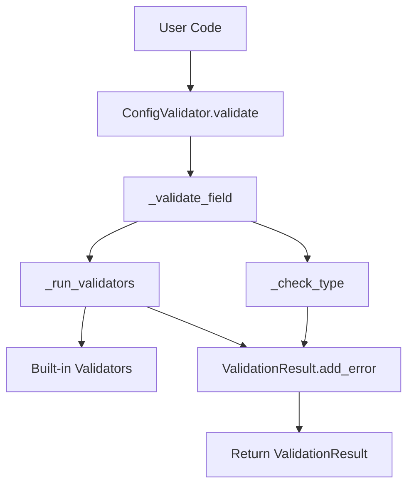
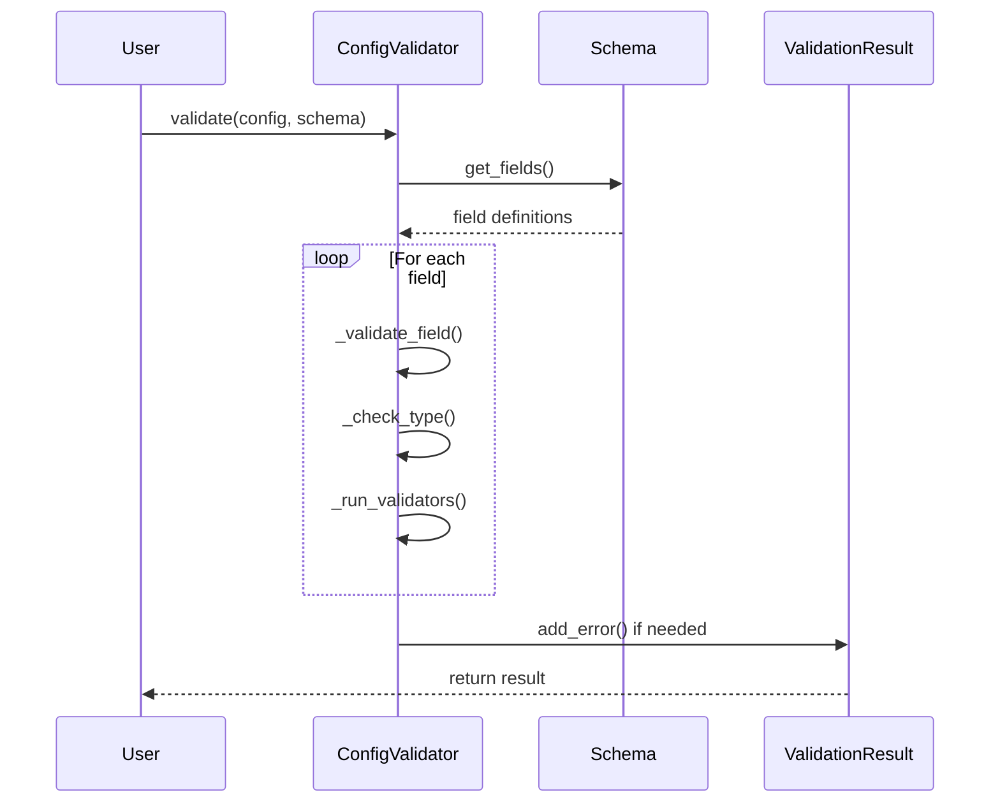
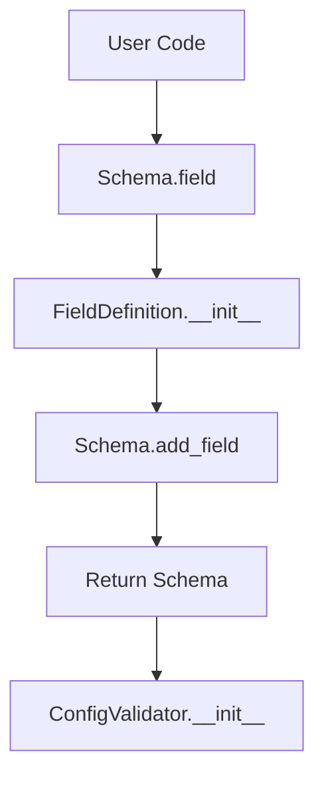
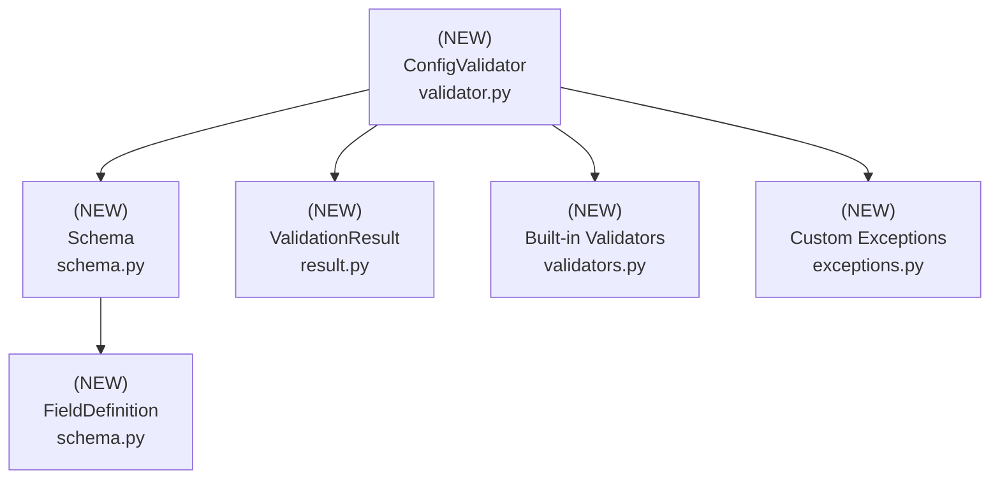

# Design Document: Configuration Validator

## Overview

### High-Level Description

This feature adds a robust configuration validation system to the belgie project. It provides a declarative way to
define configuration schemas and validate configuration dictionaries against those schemas. The validator will support
type checking, value constraints, required fields, and custom validation rules.

The problem this solves: Currently, there's no centralized way to validate configuration inputs, leading to potential
runtime errors when invalid configurations are passed to modules.

### Goals

- Provide a simple, declarative API for defining configuration schemas
- Support common validation patterns (type checking, required fields, ranges, patterns)
- Generate clear, actionable error messages for validation failures
- Enable custom validation rules for complex business logic
- Support nested configuration structures

### Non-Goals

- This is not a general-purpose data validation library (use pydantic for that)
- Will not support async validation
- Will not provide configuration loading/saving functionality
- Will not handle environment variable substitution

## Workflows

### Workflow 1: Configuration Validation

#### Description

User creates a schema, passes a config dict to validator, and receives validation results with detailed error messages
if validation fails.

#### Usage Example

```python
from belgie.config_validator import ConfigValidator, Schema
from belgie.config_validator.validators import range_validator

# Create schema (typically done once at module initialization)
schema = (
    Schema()
    .field("host", str, required=True, default="localhost")
    .field("port", int, required=True, validators=[range_validator(1, 65535)])
    .field("timeout", int, default=30, validators=[range_validator(1, 300)])
)

# Create validator
validator = ConfigValidator(schema)

# Validate configuration
config = {"host": "example.com", "port": 8080, "timeout": 60}
result = validator.validate(config)

if result:
    print("Configuration is valid!")
else:
    for error in result.errors:
        print(f"Error in {error['field']}: {error['message']}")
```

#### Call Graph



#### Sequence Diagram



#### Key Components

- **ConfigValidator** (`validator.py:ConfigValidator`) - Main validation orchestrator
- **Schema** (`schema.py:Schema`) - Schema definition container
- **ValidationResult** (`result.py:ValidationResult`) - Validation result container
- **Built-in Validators** (`validators.py`) - Type checking, range validation, etc.

### Workflow 2: Schema Construction

#### Description

User builds a schema using fluent API, defining fields with types and constraints.

#### Usage Example

```python
from belgie.config_validator import Schema
from belgie.config_validator.validators import pattern_validator, length_validator

# Build schema using fluent API
schema = (
    Schema()
    .field("username", str, required=True, validators=[
        length_validator(min_length=3, max_length=20),
        pattern_validator(r'^[a-zA-Z0-9_]+$')
    ])
    .field("email", str, required=True, validators=[
        pattern_validator(r'^[a-zA-Z0-9._%+-]+@[a-zA-Z0-9.-]+\.[a-zA-Z]{2,}$')
    ])
    .field("age", int, required=False, validators=[
        range_validator(min_val=13, max_val=120)
    ])
)

# Schema is now ready to be used with ConfigValidator
```

#### Call Graph



#### Key Components

- **Schema** (`schema.py:Schema`) - Fluent API for schema construction
- **FieldDefinition** (`schema.py:FieldDefinition`) - Individual field configuration
- **ConfigValidator** (`validator.py:ConfigValidator`) - Consumes the built schema

## Dependencies



## Detailed Design

### Module Structure

```text
src/belgie/
├── config_validator/
│   ├── validator.py         # ConfigValidator (see Workflow 1)
│   ├── schema.py            # Schema, FieldDefinition (see Workflow 2)
│   ├── result.py            # ValidationResult (see Implementation #2)
│   ├── validators.py        # Built-in validators (see Implementation #4)
│   └── exceptions.py        # Custom exceptions (see Implementation #1)
└── __test__/
    └── config_validator/
        ├── test_validator.py            # Unit tests for validator.py
        ├── test_schema.py               # Unit tests for schema.py
        ├── test_result.py               # Unit tests for result.py
        ├── test_validators.py           # Unit tests for validators.py
        └── test_validator_integration.py # Integration tests
```

### API Design

#### `src/belgie/config_validator/exceptions.py`

Custom exception types for validation and schema errors.

```python
class ValidationError(Exception):
    def __init__(self, message: str, field_path: str | None = None) -> None: ...
    # 1. Store field_path as self.field_path
    # 2. Call super().__init__(message) to set exception message

class SchemaError(Exception): ...
# Simple exception, no custom implementation needed
```

#### `src/belgie/config_validator/result.py`

Data structures for validation results and error tracking.

```python
from typing import TypedDict

class ValidationError(TypedDict):
    field: str
    message: str
    value: object

class ValidationResult:
    # Used in: Workflow 1 (see sequence diagram)

    def __init__(is_valid: bool, errors: list[ValidationError] | None = None) -> None: ...
    # 1. Store is_valid flag as self.is_valid
    # 2. Initialize self.errors with errors if provided, otherwise empty list
    # 3. Set is_valid to False if errors list is not empty

    def add_error(field: str, message: str, value: object = None) -> None: ...
    # 1. Create ValidationError dict with field, message, and value keys
    # 2. Append error dict to self.errors list
    # 3. Set self.is_valid = False to mark result as invalid
    # Called by ConfigValidator._validate_field()

    def merge(other: "ValidationResult") -> None: ...
    # 1. Extend self.errors with all errors from other.errors
    # 2. Update self.is_valid to False if other.is_valid is False
    # 3. Used to combine validation results from multiple fields

    def __bool__() -> bool:
        return self.is_valid

    def __repr__() -> str:
        return f"ValidationResult(is_valid={self.is_valid}, errors={len(self.errors)})"
```

#### `src/belgie/config_validator/validators.py`

Built-in validator functions for common validation patterns (leaf node, see [Implementation Order](#implementation-order) #4).

```python
import re
from typing import Callable

ValidatorFunc = Callable[[object], bool]

def required() -> ValidatorFunc:
    # Used in: Workflow 1 (field validation)
    def validator(value: object) -> bool: ...
    # 1. Return True if value is not None
    # 2. Return False if value is None
    # Used to enforce required fields
    return validator

def type_validator(expected_type: type) -> ValidatorFunc:
    # Used in: Workflow 1 (type checking)
    def validator(value: object) -> bool: ...
    # 1. Use isinstance(value, expected_type) to check type
    # 2. Return True if type matches, False otherwise
    # Supports built-in types (int, str, list, dict) and custom classes
    return validator

def range_validator(min_val: int | float | None = None, max_val: int | float | None = None) -> ValidatorFunc:
    # Used in: Workflow 1 (numeric constraints)
    def validator(value: object) -> bool: ...
    # 1. Check value is numeric (int or float) using isinstance
    # 2. If min_val provided, verify value >= min_val
    # 3. If max_val provided, verify value <= max_val
    # 4. Return True if all checks pass, False otherwise
    return validator

def pattern_validator(pattern: str) -> ValidatorFunc:
    # Used in: Workflow 1 (string pattern matching)
    compiled_pattern = re.compile(pattern)
    def validator(value: object) -> bool: ...
    # 1. Check value is a string using isinstance
    # 2. Use compiled_pattern.match() or search() to test pattern
    # 3. Return True if pattern matches, False otherwise
    # Pattern compiled once at validator creation for efficiency
    return validator

def length_validator(min_length: int | None = None, max_length: int | None = None) -> ValidatorFunc:
    # Used in: Workflow 1 (sequence length validation)
    def validator(value: object) -> bool: ...
    # 1. Check value has __len__ attribute (strings, lists, tuples, dicts)
    # 2. Get length using len(value)
    # 3. If min_length provided, verify len(value) >= min_length
    # 4. If max_length provided, verify len(value) <= max_length
    # 5. Return True if all checks pass, False otherwise
    return validator

def oneof_validator(allowed_values: list[object]) -> ValidatorFunc:
    # Used in: Workflow 1 (enum-like validation)
    allowed_set = set(allowed_values)
    def validator(value: object) -> bool: ...
    # 1. Check if value in allowed_set using membership test
    # 2. Return True if value found, False otherwise
    # Set created once at validator creation for O(1) lookup
    return validator
```

#### `src/belgie/config_validator/schema.py`

Schema and field definition classes for declarative configuration (see [Implementation Order](#implementation-order) #3, #5).

```python
from typing import Self

from belgie.config_validator.validators import ValidatorFunc

class FieldDefinition:
    # Used in: Workflow 2 (schema construction)

    def __init__(
        field_type: type,
        required: bool = False,
        default: object = None,
        validators: list[ValidatorFunc] | None = None,
        description: str = "",
    ) -> None: ...
    # 1. Store field_type as self.field_type
    # 2. Store required flag as self.required
    # 3. Store default value as self.default
    # 4. Initialize self.validators with validators list or empty list if None
    # 5. Store description as self.description

    def add_validator(validator: ValidatorFunc) -> Self: ...
    # 1. Append validator to self.validators list
    # 2. Return self for method chaining
    # Enables fluent API for adding validators dynamically

class Schema:
    # Used in: Workflow 1, Workflow 2 (schema definition)

    def __init__(fields: dict[str, FieldDefinition] | None = None) -> None: ...
    # 1. Initialize self.fields as empty dict
    # 2. If fields parameter provided, populate self.fields with it
    # 3. Store field definitions keyed by field name

    def add_field(name: str, field_def: FieldDefinition) -> Self: ...
    # 1. Add field_def to self.fields dict with name as key
    # 2. Return self for method chaining
    # Enables building schemas programmatically

    def field(
        name: str,
        field_type: type,
        required: bool = False,
        default: object = None,
        validators: list[ValidatorFunc] | None = None,
        description: str = "",
    ) -> Self: ...
    # 1. Create new FieldDefinition with all provided parameters
    # 2. Call self.add_field(name, field_def) to add to schema
    # 3. Return self for method chaining
    # Used in: Workflow 2 (fluent API for schema construction)

    def get_field(name: str) -> FieldDefinition | None:
        return self.fields.get(name)

    def get_required_fields() -> list[str]: ...
    # 1. Iterate through self.fields items
    # 2. Filter to only fields where field_def.required is True
    # 3. Return list of field names (not FieldDefinition objects)
    # Used in: Workflow 1 (validation to check required fields)
```

#### `src/belgie/config_validator/validator.py`

Main validator class that orchestrates validation logic (see [Implementation Order](#implementation-order) #6).

```python
from typing import Any

from belgie.config_validator.exceptions import SchemaError, ValidationError
from belgie.config_validator.result import ValidationResult
from belgie.config_validator.schema import FieldDefinition, Schema

class ConfigValidator:
    # Main entry point for Workflow 1

    def __init__(schema: Schema) -> None: ...
    # 1. Validate that schema is a Schema instance
    # 2. Check schema has at least one field defined (optional validation)
    # 3. Store schema as self.schema for later use
    # Used in: Workflow 2 (after schema construction)

    def validate(config: dict[str, Any]) -> ValidationResult: ...
    # 1. Create new ValidationResult with is_valid=True, errors=[]
    # 2. Get required fields from self.schema.get_required_fields()
    # 3. Check all required fields are present in config, add errors if missing
    # 4. For each field in config, get field_def from schema and call _validate_field()
    # 5. Return the ValidationResult with accumulated errors
    # Main orchestrator for Workflow 1 (see sequence diagram)

    def validate_and_raise(config: dict[str, Any]) -> None: ...
    # 1. Call self.validate(config) to get ValidationResult
    # 2. If result.is_valid is False, raise ValidationError with error details
    # 3. If valid, return silently (None)
    # Convenience method for code that wants exception-based error handling

    def _validate_field(
        field_name: str,
        value: Any,
        field_def: FieldDefinition,
        result: ValidationResult,
    ) -> None: ...
    # 1. Call self._check_type(value, field_def.field_type) to verify type
    # 2. If type check fails, call result.add_error() with type mismatch message
    # 3. If type valid, call self._run_validators() with field_def.validators
    # 4. All errors are accumulated in result object
    # Called from validate() for each field

    def _check_type(value: Any, expected_type: type) -> bool: ...
    # 1. Use isinstance(value, expected_type) for type checking
    # 2. Handle special cases (None, union types if needed)
    # 3. Return True if type matches, False otherwise
    # Called from _validate_field()

    def _run_validators(
        field_name: str,
        value: Any,
        validators: list,
        result: ValidationResult,
    ) -> None: ...
    # 1. Loop through each validator function in validators list
    # 2. Call validator(value) to get boolean result
    # 3. If validator returns False, call result.add_error() with field_name
    # 4. Continue checking all validators (don't short-circuit)
    # Called from _validate_field()

    @staticmethod
    def _get_type_name(value_type: type) -> str: ...
    # 1. Check if value_type has __name__ attribute (most types do)
    # 2. Return value_type.__name__ for built-in types (str, int, etc.)
    # 3. Handle special cases like typing.Union, typing.Optional if needed
    # 4. Return str(value_type) as fallback for complex generic types
    # Used for generating human-readable error messages
```

### Testing Strategy

Tests should be organized by module/file and cover unit tests, integration tests, and edge cases.

#### `test_validators.py`

**Validator Functions Tests:**

- Test `required()` validator with non-None values (should pass)
- Test `required()` validator with None (should fail)
- Test `type_validator()` with matching types (str, int, list, dict, custom classes)
- Test `type_validator()` with mismatched types
- Test `range_validator()` with values in range, at boundaries, and outside range
- Test `range_validator()` with non-numeric types (should handle gracefully)
- Test `pattern_validator()` with strings matching regex patterns
- Test `pattern_validator()` with non-matching strings
- Test `pattern_validator()` with non-string types
- Test `length_validator()` with sequences of various lengths (strings, lists, tuples)
- Test `length_validator()` with objects without `__len__` (should handle gracefully)
- Test `oneof_validator()` with values in allowed set
- Test `oneof_validator()` with values not in allowed set
- Use parametrized tests for comprehensive coverage of boundary conditions

#### `test_schema.py`

**FieldDefinition Class Tests:**

- Test `FieldDefinition.__init__()` with various configurations
- Test `FieldDefinition.add_validator()` method (chaining behavior)

**Schema Class Tests:**

- Test `Schema.__init__()` with empty and pre-populated fields
- Test `Schema.add_field()` with valid field definitions
- Test `Schema.field()` fluent API (chaining multiple calls)
- Test `Schema.get_field()` with existing and non-existing field names
- Test `Schema.get_required_fields()` with mixed required/optional fields
- Verify [Workflow 2](#workflow-2-schema-construction) (schema construction) works as expected

#### `test_validator.py`

**ConfigValidator Class Tests:**

- Test `ConfigValidator.__init__()` with valid and invalid schemas
- Test `ConfigValidator.validate()` with fully valid configurations
- Test `ConfigValidator.validate()` with missing required fields (check error messages)
- Test `ConfigValidator.validate()` with wrong field types (check type error messages)
- Test `ConfigValidator.validate()` with custom validator failures
- Test `ConfigValidator.validate()` accumulates multiple errors correctly
- Test `ConfigValidator.validate_and_raise()` raises exception on invalid config
- Test `ConfigValidator.validate_and_raise()` succeeds silently on valid config
- Test `ConfigValidator._check_type()` with various type combinations
- Test `ConfigValidator._run_validators()` with multiple validators on same field
- Test `ConfigValidator._get_type_name()` returns readable names for built-in and custom types
- Use parametrized tests for comprehensive config scenarios (valid port/host combinations, etc.)

#### `test_result.py` (if separate)

**ValidationResult Class Tests:**

- Test `ValidationResult.__init__()` with various initial states
- Test `ValidationResult.add_error()` method (verify error dict structure, is_valid flag updates)
- Test `ValidationResult.merge()` method combines errors from multiple results
- Test `ValidationResult.__bool__()` operator returns correct boolean value
- Test `ValidationResult.__repr__()` produces readable string representation

**Integration Tests:**

- Test [Workflow 1](#workflow-1-configuration-validation) end-to-end: construct schema, create validator, validate valid config, validate invalid config
- Test [Workflow 2](#workflow-2-schema-construction) end-to-end: build schema using fluent API, then use it for validation
- Test error handling across module boundaries (exceptions propagate correctly)
- Test complex schemas with multiple fields, types, and validators
- Test realistic use cases: server config (host, port, timeout), user profile (name, email, age), etc.

**Edge Cases to Cover:**

- Empty configurations vs. empty schemas
- None values in various contexts
- Extremely large configuration dictionaries
- Deeply nested data structures (if supported in future)
- Unicode and special characters in string fields
- Float vs int type checking edge cases
- Empty strings, empty lists, zero values
- Circular reference scenarios (if applicable)

## Implementation

### Implementation Order

1. **Exceptions** (`exceptions.py`) - Implement first (no dependencies)
   - Used in: [Workflow 1](#workflow-1-configuration-validation) (error handling)
   - Dependencies: None

2. **ValidationResult** (`result.py`) - Implement second (no dependencies)
   - Used in: [Workflow 1](#workflow-1-configuration-validation) (return type)
   - Dependencies: None

3. **FieldDefinition** (`schema.py:FieldDefinition`) - Implement third (no dependencies)
   - Used in: [Workflow 2](#workflow-2-schema-construction) (schema construction)
   - Dependencies: None

4. **Built-in Validators** (`validators.py`) - Implement fourth (no dependencies)
   - Used in: [Workflow 1](#workflow-1-configuration-validation) (field validation)
   - Dependencies: None

5. **Schema** (`schema.py:Schema`) - Implement fifth (depends on FieldDefinition)
   - Used in: [Workflow 1](#workflow-1-configuration-validation), [Workflow 2](#workflow-2-schema-construction)
   - Dependencies: FieldDefinition

6. **ConfigValidator** (`validator.py:ConfigValidator`) - Implement last (depends on all above)
   - Used in: [Workflow 1](#workflow-1-configuration-validation) (main orchestrator)
   - Dependencies: Schema, ValidationResult, Validators, Exceptions

### Tasks

- [ ] **Implement leaf node components** (no dependencies on new code)
  - [ ] Implement `Exceptions` in `exceptions.py` (#1)
    - [ ] Implement `ValidationError` exception
    - [ ] Implement `SchemaError` exception
  - [ ] Implement `ValidationResult` class in `result.py` (#2)
    - [ ] Implement `__init__()` method
    - [ ] Implement `add_error()` method (used in [Workflow 1](#workflow-1-configuration-validation))
    - [ ] Implement `merge()` method
    - [ ] Implement `__bool__()` and `__repr__()` methods
  - [ ] Write unit tests for `result.py`
    - [ ] Test initialization, add_error, merge, boolean conversion
  - [ ] Implement `FieldDefinition` class in `schema.py` (#3)
    - [ ] Implement `__init__()` method
    - [ ] Implement `add_validator()` method
  - [ ] Implement built-in validators in `validators.py` (#4)
    - [ ] Implement `required()` validator
    - [ ] Implement `type_validator()` validator
    - [ ] Implement `range_validator()` validator
    - [ ] Implement `pattern_validator()` validator
    - [ ] Implement `length_validator()` validator
    - [ ] Implement `oneof_validator()` validator
  - [ ] Write unit tests for `validators.py`
    - [ ] Comprehensive tests for each validator function

- [ ] **Implement components with single-level dependencies**
  - [ ] Implement `Schema` class in `schema.py` (#5)
    - [ ] Implement `__init__()` method
    - [ ] Implement `add_field()` method
    - [ ] Implement `field()` method ([Workflow 2](#workflow-2-schema-construction) fluent API)
    - [ ] Implement `get_field()` method
    - [ ] Implement `get_required_fields()` method (used in [Workflow 1](#workflow-1-configuration-validation))
  - [ ] Write unit tests for `schema.py`
    - [ ] Test FieldDefinition and Schema classes
    - [ ] Test fluent API ([Workflow 2](#workflow-2-schema-construction))

- [ ] **Implement top-level components** (depends on all above)
  - [ ] Implement `ConfigValidator` class in `validator.py` (#6)
    - [ ] Implement `__init__()` method
    - [ ] Implement `validate()` method (main [Workflow 1](#workflow-1-configuration-validation) orchestrator)
    - [ ] Implement `validate_and_raise()` method
    - [ ] Implement `_validate_field()` private method
    - [ ] Implement `_check_type()` private method
    - [ ] Implement `_run_validators()` private method
    - [ ] Implement `_get_type_name()` static method
  - [ ] Write unit tests for `validator.py`
    - [ ] Comprehensive validation tests
    - [ ] Error handling tests
    - [ ] Parametrized test scenarios

- [ ] **Integration and validation**
  - [ ] Add integration tests for [Workflow 1](#workflow-1-configuration-validation) (full validation flow)
  - [ ] Add integration tests for [Workflow 2](#workflow-2-schema-construction) (schema construction + usage)
  - [ ] Add type hints and run type checker (`uv run ty`)
  - [ ] Run linter and fix issues (`uv run ruff check`)
  - [ ] Verify all tests pass (`uv run pytest`)

## Open Questions

1. Should we support nested configuration validation (configs within configs)?
2. Do we need async validator support in the future?
3. Should validators be able to modify values (coercion) or just validate?
4. Do we want to generate JSON Schema from our Schema definitions?

## Future Enhancements

- Add support for nested configuration structures
- Implement configuration coercion (automatic type conversion)
- Add JSON Schema export capability
- Create CLI tool for validating config files
- Add support for configuration documentation generation
- Implement configuration diffing (compare two configs)

## Alternative Approaches

### Approach 1: Using Pydantic

**Description**: Use the popular Pydantic library for configuration validation instead of building a custom validator.

**Pros**:

- Battle-tested library with extensive features
- Automatic type coercion and parsing
- JSON Schema generation built-in
- Excellent documentation and community support
- Better performance with Rust-based validation

**Cons**:

- Adds external dependency to the project
- Opinionated API that may not match our specific needs
- Heavier weight than needed for simple validation
- Learning curve for team members unfamiliar with Pydantic
- May be overkill for this specific use case

**Why not chosen**: The goal is to create a lightweight, project-specific validator that demonstrates architectural
patterns and has no external dependencies. This is an educational exercise in building validation systems.

### Approach 2: Class-Based Validators

**Description**: Use classes for validators instead of factory functions returning closures.

**Pros**:

- More explicit object-oriented design
- Easier to subclass and extend validators
- Can maintain state between validations if needed
- May be more familiar to developers from OOP backgrounds

**Cons**:

- More boilerplate code (defining classes vs simple functions)
- Heavier memory footprint (class instances vs closures)
- Less functional programming style
- Slightly more complex API for simple validators

**Why not chosen**: Closures provide a cleaner, more functional API for simple validators. The factory function pattern
(`range_validator(1, 100)`) is more concise and readable than instantiating classes (`RangeValidator(min=1, max=100)`).
Since validators are stateless operations, functions are a better fit than classes.

### Approach 3: Decorator-Based Schema Definition

**Description**: Use decorators to define schemas directly on dataclasses or regular classes.

**Pros**:

- Schema definition lives with the data structure
- Type hints can be used for validation
- Less separation between definition and validation
- Popular pattern in frameworks like FastAPI

**Cons**:

- Couples validation logic to data structures
- Less flexible for dynamic schema creation
- Harder to reuse schemas across different classes
- May not work well for validating plain dictionaries

**Why not chosen**: The fluent API approach (`Schema().field(...)`) provides better separation of concerns and is more
flexible for this use case. We're validating arbitrary configuration dictionaries, not necessarily tied to specific
classes.
