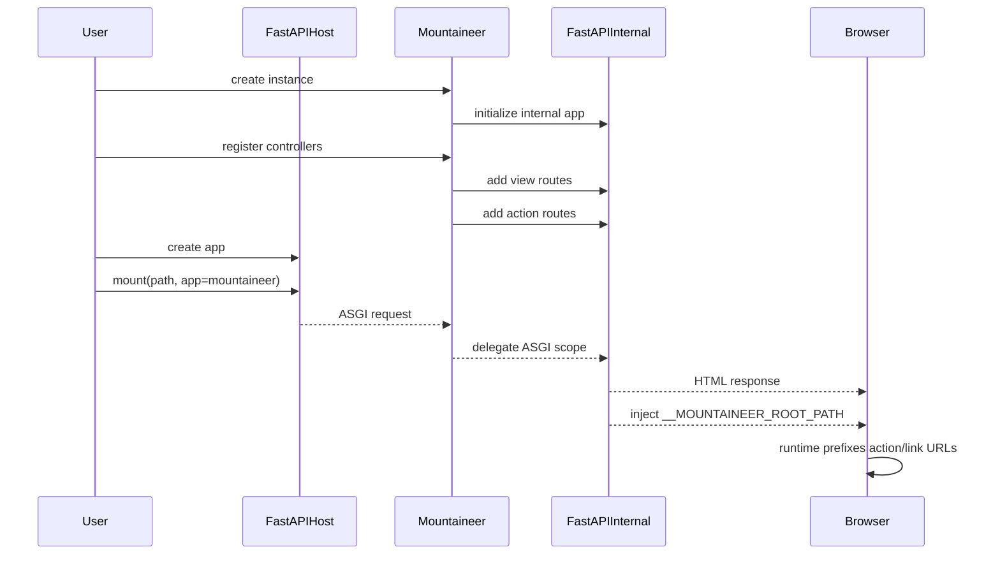
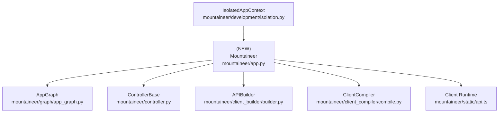

# Design Document: Mountable Sub-App Integration (No Mount Path)

## Overview

### High-Level Description

Mountaineer currently owns the FastAPI application inside `AppController`, which forces users to reach through
`controller.app` or maintain a separate `app = controller.app` file for ASGI deployment. This design replaces that
pattern with a mountable `Mountaineer` ASGI application that can be attached to a user-owned FastAPI app via
`app.mount(path="/", app=mountaineer, name="website")`. Mountaineer manages its internal FastAPI app, routes, static
mounts, and OpenAPI customization internally, while the outer FastAPI app remains fully configurable by users.

The mount prefix is resolved at runtime instead of configuration time. The server injects the active `root_path` into
HTML responses, and the client-side runtime prefixes all generated action and link URLs using that value. This removes
any need for a `mount_path` parameter while preserving correct URL generation under subpath mounts.

### Goals

- Allow users to mount Mountaineer directly as a sub-application: `app.mount(path="/", app=mountaineer, name=...)`.
- Make `Mountaineer` an ASGI app (delegating to an internal FastAPI instance).
- Resolve mount prefixes at runtime using `root_path`, with no build-time mount configuration.
- Keep internal routing, URL generation, and client builder outputs correct under subpath mounts.
- Maintain Mountaineer’s existing exception handling, static mounts, and OpenAPI enrichment within the sub-app.
- Expose OpenAPI only on the Mountaineer sub-app (not merged into the host app).
- Update templates, docs, and dev tooling to demonstrate and support the sub-app mounting workflow.

### Non-Goals

- Supporting the legacy `AppController` workflow.
- Supporting mount-path changes after controllers are registered.
- Deriving mount prefixes during build/codegen (e.g., from `request.url_for`).
- Altering the static asset path (`/static`) or the existing build pipeline semantics.

## Workflows

### Workflow 1: External FastAPI App Mounts Mountaineer

#### Description

Users create their own `FastAPI` app, configure middleware/lifespan as needed, then mount a `Mountaineer` instance as
an ASGI sub-application. Mountaineer uses its internal FastAPI app for all routing, exception handling, static mounts,
and OpenAPI generation. The active mount prefix is injected into HTML responses and used by the client runtime to prefix
requests and link generation.

#### Usage Example

```python
from pathlib import Path

from fastapi import FastAPI
from mountaineer import Mountaineer
from mountaineer.client_compiler.postcss import PostCSSBundler
from mountaineer.render import LinkAttribute, Metadata

from my_webapp.config import AppConfig
from my_webapp.controllers.home import HomeController

mountaineer = Mountaineer(
    config=AppConfig(),
    view_root=Path("views"),
    global_metadata=Metadata(
        links=[LinkAttribute(rel="stylesheet", href="/static/app_main.css")]
    ),
    custom_builders=[PostCSSBundler()],
)
mountaineer.register(HomeController())

app = FastAPI(lifespan=app_lifespan)
app.mount(path="/", app=mountaineer, name="website")
```

#### Call Graph

```mermaid
graph TD
    A[User Code] --> B[Mountaineer.__init__]
    B --> C[FastAPI() internal]
    A --> D[Mountaineer.register]
    D --> E[_register_controller_common]
    E --> F[FastAPI internal: include view + action routes]
    A --> G[FastAPI.mount(path, app=mountaineer)]
    G --> H[ASGI dispatch]
    H --> I[Mountaineer.__call__]
    I --> J[FastAPI internal app]
    J --> K[_generate_controller_html]
    K --> L[Inject root_path into HTML]
```

#### Sequence Diagram



#### Key Components

- **Mountaineer** (`mountaineer/app.py:Mountaineer`) - ASGI wrapper around internal FastAPI app
- **FastAPI (internal)** (`fastapi.FastAPI`) - Handles Mountaineer routes, static mounts, handlers, OpenAPI
- **FastAPI (host)** (`fastapi.FastAPI`) - User-owned app mounting Mountaineer sub-app
- **Client runtime** (`mountaineer/static/api.ts`) - Prefixes URLs with injected root path
- **ControllerDefinition** (`mountaineer/graph/app_graph.py:ControllerDefinition`) - Holds per-controller routing

## Dependencies



## Detailed Design

### Module Structure

```text
mountaineer/
├── app.py                          # Add Mountaineer ASGI core + root_path injection
├── __init__.py                     # Export Mountaineer
├── static/
│   └── api.ts                      # Prefix URLs with injected root_path
├── development/
│   └── isolation.py                # Accept Mountaineer for dev workflow (expects .app set)
create_mountaineer_app/
└── create_mountaineer_app/templates/project/[project_name]/
    ├── app.py                      # New mount-as-subapp example
    └── main.py                     # ASGI app uses FastAPI directly
mountaineer/__tests__/
├── test_app.py                     # Add Mountaineer sub-app tests
└── actions/test_passthrough_dec.py # Ensure action routes work via mounted sub-app

docs/
├── guides/quickstart/page.mdx       # Update example to Mountaineer + FastAPI.mount
├── guides/structure/page.mdx        # Update description of app.py/main.py
└── api/controllers/page.mdx         # Add Mountaineer to API docs
```

### API Design

#### `mountaineer/app.py`

Add a mountable `Mountaineer` ASGI core with runtime root-path injection.

```python
from fastapi import FastAPI, Request
from starlette.types import Scope, Receive, Send

class Mountaineer:
    def __init__(
        self,
        *,
        name: str = "Mountaineer Webapp",
        version: str = "0.1.0",
        view_root: Path | None = None,
        global_metadata: Metadata | None = None,
        custom_builders: list[APIBuilderBase] | None = None,
        config: ConfigBase | None = None,
        fastapi_args: dict[str, Any] | None = None,
    ) -> None: ...
    # 1. Create internal FastAPI app (title/version/fastapi_args)
    # 2. Initialize graph/builders/config/global_metadata
    # 3. Resolve view_root (config.PACKAGE or view_root)
    # 4. Validate views directory and config
    # 5. Mount static dir and register exception handlers on internal app
    # 6. Override internal app.openapi to call self.generate_openapi(routes=app.routes)

    app: FastAPI

    async def __call__(self, scope: Scope, receive: Receive, send: Send) -> None: ...
    # 1. Delegate directly to self.app

    def register(self, controller: ControllerBase | MountaineerPlugin) -> None: ...
    # 1. Dispatch to _register_controller or _register_plugin

    def _register_controller_common(self, controller: ControllerBase, dev_enabled: bool) -> ControllerDefinition: ...
    # 1. Validate controller + register in AppGraph
    # 2. Build view_router and action_router (APIRouter)
    # 3. Include routers into internal FastAPI app
    # 4. Populate ControllerRoute.url_prefix with internal_api_prefix
    # 5. Register controller URL in metadata using internal_api_prefix

    async def _generate_controller_html(..., **kwargs) -> HTMLResponse: ...
    # 1. Extract Request from kwargs (if present) to read scope["root_path"]
    # 2. Render controller as today
    # 3. Inject a global root path into HTML:
    #    window.__MOUNTAINEER_ROOT_PATH = "{root_path}";
    # 4. Return HTMLResponse

    def _get_value_mask_for_signature(...): ...
    # 1. Filter kwargs for render signature, leaving Request untouched
```

#### `mountaineer/static/api.ts`

Prefix all action and link URLs with the runtime root path injected into HTML.

```typescript
const ROOT_PATH = (globalThis as any).__MOUNTAINEER_ROOT_PATH ?? "";
const withRootPath = (url: string) =>
  ROOT_PATH && url.startsWith("/") ? `${ROOT_PATH}${url}` : url;

// In __request:
let url = new ServerURL(withRootPath(params.url));

// In __getLink:
const url = new ServerURL(withRootPath(params.rawUrl));
```

#### `mountaineer/__init__.py`

Export the new `Mountaineer` class alongside existing exports.

```python
from mountaineer.app import Mountaineer as Mountaineer
```

#### `create_mountaineer_app/.../app.py`

Update template to show sub-app mounting.

```python
from fastapi import FastAPI
from mountaineer import Mountaineer

mountaineer = Mountaineer(config=AppConfig())
mountaineer.register(HomeController())

app = FastAPI()
app.mount(path="/", app=mountaineer, name="website")
```

### Testing Strategy

Tests should be organized by module/file and cover unit tests, integration tests, and edge cases.

#### `mountaineer/__tests__/test_app.py`

**Mountaineer sub-app tests:**

- Mount at root: create `FastAPI()` and `Mountaineer(view_root=...)`, register a controller, then `app.mount("/", app=mountaineer)`
- Verify the view route is reachable via `TestClient(app)`
- Verify action routes are reachable via `TestClient(app)`
- Ensure `Mountaineer.__call__` delegates to the internal app
- Verify OpenAPI is exposed only on the sub-app (`/openapi.json` under mount, not host root)

**Subpath mount tests:**

- Mount at `/sub`: `app.mount("/sub", app=mountaineer)`
- Verify HTML includes `__MOUNTAINEER_ROOT_PATH` set to `/sub`
- Verify action routes reachable at `/sub/internal/api/...` via `TestClient(app)`
- Verify rendered page routes resolve at `/sub/<controller>`

#### `mountaineer/__tests__/actions/test_passthrough_dec.py`

**Action endpoint coverage via sub-app integration:**

- Register controller with passthrough action
- Mount `mountaineer` via `app.mount(...)`
- Call action endpoint and validate response

#### `mountaineer/__tests__/client_builder/test_runtime_prefix.py` (new)

**Runtime prefix injection tests:**

- Assert generated `_server/api.ts` contains root-path prefix logic
- Assert injected HTML includes `__MOUNTAINEER_ROOT_PATH` global

**Edge Cases to Cover:**

- Empty `root_path` results in no prefixing
- Root path with trailing slash is normalized correctly (no double slashes)

## Implementation

### Implementation Order

1. **Mountaineer core** (`mountaineer/app.py`) - Add mountable ASGI class and root-path injection
2. **Client runtime** (`mountaineer/static/api.ts`) - Prefix URLs using injected root path
3. **Dev integration** (`mountaineer/development/isolation.py`) - Accept Mountaineer instance with `.app` set
4. **Exports and docs** (`mountaineer/__init__.py`, docs, templates) - Surface the new API
5. **Tests** (`mountaineer/__tests__`) - Add sub-app coverage and runtime prefix checks

### Tasks

- [x] **Core routing changes**
  - [x] Add `Mountaineer` ASGI class with internal FastAPI app
  - [x] Update `_register_controller_common()` to use internal app routing only
  - [x] Extend view handler signature to accept `Request` and inject `root_path` into HTML
  - [x] Ensure `Request` is filtered out before calling user `render()`

- [x] **Client runtime updates**
  - [x] Add root-path prefixing to `__request` in `mountaineer/static/api.ts`
  - [x] Add root-path prefixing to `__getLink` in `mountaineer/static/api.ts`
  - [x] Add defensive normalization to avoid `//` in URLs

- [x] **Dev tooling updates**
  - [x] Update `mountaineer/development/isolation.py` to accept Mountaineer (not AppController)
  - [x] Update plugin helpers that return `AppController` to return Mountaineer or a mounted host app

- [x] **Docs and templates**
  - [x] Update `create_mountaineer_app` templates to use `Mountaineer` + `FastAPI.mount`
  - [x] Update quickstart and structure docs with new usage
  - [x] Add `Mountaineer` to API docs

- [x] **Tests and validation**
  - [x] Add root mount tests in `mountaineer/__tests__/test_app.py`
  - [x] Add subpath mount tests with HTML root-path injection
  - [x] Add runtime prefix tests for `api.ts`
  - [x] Add passthrough action routing test via sub-app mount
  - [x] Run `uv run pytest` to validate existing and new coverage

## Open Questions

1. Should static assets also be prefixed via `__MOUNTAINEER_ROOT_PATH`, or is `/static` under the sub-app sufficient?
2. Do we need a guardrail if the sub-app is mounted under a path but the host strips `root_path`?

## Future Enhancements

- Add a `Mountaineer.mount_into(app, path, name)` helper to mount and validate root_path in one step
- Provide migration notes for users moving from `AppController` to `Mountaineer`

## Libraries

### New Libraries

None.

### Existing Libraries

| Library | Current Version | Purpose | Dependency Group |
|---------|-----------------|---------|------------------|
| `fastapi` | `>=0.100` (existing) | Web framework and routing | core |

## Alternative Approaches

### Approach 1: Build-Time Mount Prefix (`mount_path`)

**Description**: Require users to supply a `mount_path` and bake it into codegen URLs.

**Pros**:

- Simple and explicit configuration
- No client runtime changes required

**Cons**:

- Easy to misconfigure if mount path changes
- Adds extra setup friction for users
- Not aligned with ASGI sub-app root_path conventions

**Why not chosen**: The root-path injection approach removes configuration while staying consistent with FastAPI’s
mounting model.

### Approach 2: Router-First Integration

**Description**: Keep `Mountaineer.router` as the integration point and use `app.include_router(mountaineer.router)`.

**Pros**:

- Uses FastAPI-native router composition
- Easier to stack multiple Mountaineer instances as routers

**Cons**:

- Still requires an extra inclusion step for handlers/static/OpenAPI
- Keeps a two-step mental model for mounting
- Less ergonomic than mounting as a single ASGI app

**Why not chosen**: The requested workflow is `app.mount(path, app=mountaineer)`, which is more direct and avoids
manual router wiring.
