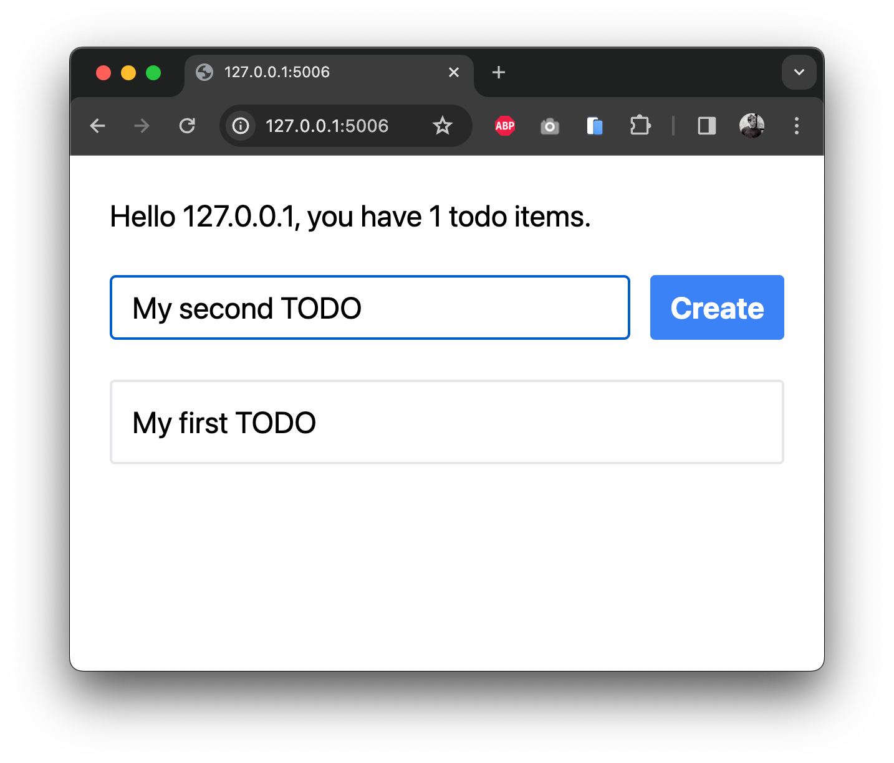
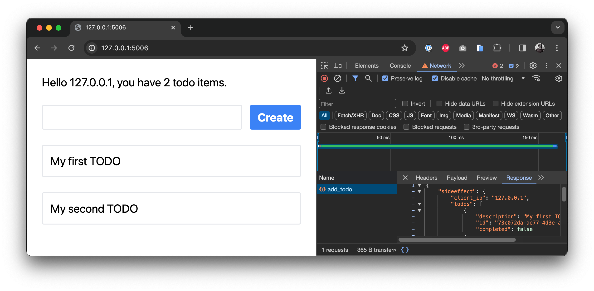

# Quickstart

Our quickstart guide walks you through creating a full Mountaineer project. The end application is simple but fully working and ready for deployment.

### Getting Started

To get started as quickly as possible, we bundle a project generator that sets up a simple project after a quick Q&A. Make sure you have pipx [installed](https://pipx.pypa.io/stable/installation/).

```bash
$ pipx run create-mountaineer-app

? Project name [my-project]: my_webapp
? Author [Pierce Freeman <pierce@freeman.vc>] Default
? Use poetry for dependency management? [Yes] Yes
? Create stub MVC files? [Yes] Yes
? Use Tailwind CSS? [Yes] Yes
? Add editor configuration? [vscode] vscode
```

Mountaineer projects all follow a similar structure. For more on this, see our deep dive on the [structure](structure.md) conventions.

### Development

If you're starting a new application from scratch, you'll typically want to create your new database tables. Make sure you have postgres running. We bundle a docker compose file for convenience with `create-mountaineer-app`.

```bash
docker compose up -d
poetry run createdb
```

Of course you can also use an existing database instance, simply configure it in the `.env` file in the project root.

Mountaineer relies on watching your project for changes and doing progressive compilation. We provide a few CLI commands to help with this.

While doing development work, you'll usually want to preview the frontend and automatically build dependent files. You can do this with:

```bash
$ poetry run runserver

INFO:     Started server process [93111]
INFO:     Waiting for application startup.
INFO:     Application startup complete.
INFO:     Uvicorn running on http://127.0.0.1:5006 (Press CTRL+C to quit)
```

Navigate to http://127.0.0.1:5006 to see your new webapp running.

Or, if you just want to watch the source tree for changes without hosting the server. Watching will allow your frontend to pick up API definitions from your backend controllers:

```bash
$ poetry run watch
```

Both of these CLI commands are specified in your project's `cli.py` file.

### Walkthrough

Below we go through some of the unique aspects of Mountaineer. Let's create a simple Todo list where we can add new items.

For the purposes of this walkthrough we assume your project is generated with `create-mountaineer-app` and you've skipped MVC stub files. If not, you'll have to delete some of the pre-existing files.

Let's get started by creating the data models that will persist app state to the database. These definitions are effectively Pydantic schemas that will be bridged to the database via [SQLModel](https://github.com/tiangolo/sqlmodel).

```python title="my_webapp/models/todo.py"
from mountaineer.database import SQLModel, Field
from uuid import UUID, uuid4

class TodoItem(SQLModel, table=True):
    id: UUID = Field(default_factory=uuid4, primary_key=True)

    description: str
    completed: bool = False
```

Update the index file as well:

```python title="my_webapp/models/__init__.py"
from .todo import TodoItem # noqa: F401
```

Make sure you have a Postgres database running. We bundle a docker compose file for convenience with `create-mountaineer-app`. Launch it in the background and create the new database tables from these code definitions:

```bash
docker compose up -d
poetry run createdb
poetry run runserver
```

Great! At this point we have our database tables created and have a basic server running. We next move to creating a new controller, since this will define which data you can push and pull to your frontend.

```python title="my_webapp/controllers/home.py"
from mountaineer import sideeffect, ControllerBase, RenderBase
from mountaineer.database import DatabaseDependencies

from fastapi import Request, Depends
from sqlalchemy.ext.asyncio import AsyncSession
from sqlmodel import select

from my_webapp.models.todo import TodoItem

class HomeRender(RenderBase):
    client_ip: str
    todos: list[TodoItem]

class HomeController(ControllerBase):
    url = "/"
    view_path = "/app/home/page.tsx"

    async def render(
        self,
        request: Request,
        session: AsyncSession = Depends(DatabaseDependencies.get_db_session)
    ) -> HomeRender:
        todos = (await session.exec(select(TodoItem))).all()

        return HomeRender(
            client_ip=(
                request.client.host
                if request.client
                else "unknown"
            ),
            todos=todos
        )
```

The only three requirements of a controller are setting the:

- URL
- View path
- Initial data payload

This `render()` function is a core building block of Mountaineer. All Controllers need to have one. It defines all the data that your frontend will need to resolve its view. This particular controller retrieves all Todo items from the database, alongside the user's current IP.

!!! tip

    render() functions accepts all parameters that FastAPI endpoints do: paths, query parameters, and dependency injected functions. Right now we're just grabbing the `Request` object to get the client IP.

Note that the database session is provided via dependency injection, which plug-and-plays with [FastAPI's](https://github.com/tiangolo/fastapi) Depends syntax. The standard library provides two main dependency providers:

- mountaineer.CoreDependencies: helper functions for configurations and general dependency injection
- mountaineer.database.DatabaseDependencies: helper functions for database lifecycle and management

Now that we've newly created this controller, we wire it up to the application. This registers it for display when you load the homepage.

```python title="my_webapp/app.py"
from mountaineer.app import AppController
from mountaineer.client_compiler.postcss import PostCSSBundler
from mountaineer.render import LinkAttribute, Metadata

from my_webapp.config import AppConfig
from my_webapp.controllers.home import HomeController

controller = AppController(
    config=AppConfig(),
    global_metadata=Metadata(
        links=[LinkAttribute(rel="stylesheet", href="/static/app_main.css")]
    ),
    custom_builders=[
        PostCSSBundler(),
    ],
)

controller.register(HomeController())
```

Let's move over to the frontend.

```typescript title="my_webapp/views/app/home/page.tsx"
import React from "react";
import { useServer, ServerState } from "./_server/useServer";

const CreateTodo = ({ serverState }: { serverState: ServerState }) => {
  return (
    <div className="flex gap-x-4">
      <input
        type="text"
        className="grow rounded border-2 border-gray-200 px-4 py-2"
      />
      <button className="rounded bg-blue-500 px-4 py-2 font-bold text-white hover:bg-blue-700">
        Create
      </button>
    </div>
  );
};

const Home = () => {
  const serverState = useServer();

  return (
    <div className="mx-auto max-w-2xl space-y-8 p-8 text-2xl">
      <p>
        Hello {serverState.client_ip}, you have {serverState.todos.length} todo
        items.
      </p>
      <CreateTodo serverState={serverState} />
      {
        /* Todo items are exposed as typehinted Typescript interfaces */
        serverState.todos.map((todo) => (
          <div key={todo.id} className="rounded border-2 border-gray-200 p-4">
            <div>{todo.description}</div>
          </div>
        ))
      }
    </div>
  );
};

export default Home;
```

We define a simple view to show the data coming from the backend. To accomplish this conventionally, we'd need to wire up an API layer, a Node server, or format the page with Jinja templates.

Here instead we use our automatically generated `useServer()` hook. This hook payload will provide all the `HomeRender` fields as properties of serverState. And it's available instantly on page load without any roundtrip fetches. Also - if your IDE supports language servers (which most do these days), you should see the fields auto-suggesting for `serverState` as you type.

<p align="center"></p>

If you access this in your browser at `localhost:5006/` we can see our welcome message, but we can't really _do_ anything with the todos yet. Let's add some interactivity.

!!! tip

    Try disabling Javascript in your browser. The page will still render as-is with all variables intact, thanks to our server-side rendering.

<p align="center"></p>

What good is todo list that doesn't get longer? We define a `add_todo` function that accepts a pydantic model `NewTodoRequest`, which defines the required parameters for a new todo item. We then cast this to a database object and add it to the postgres table.

```python title="my_webapp/controllers/home.py"

from pydantic import BaseModel

class NewTodoRequest(BaseModel):
    description: str

class HomeController(ControllerBase):
    ...

    @sideeffect
    async def add_todo(
        self,
        payload: NewTodoRequest,
        session: AsyncSession = Depends(DatabaseDependencies.get_db_session)
    ) -> None:
        new_todo =  TodoItem(description=payload.description)
        session.add(new_todo)
        await session.commit()
```

The important part here is the `@sideeffect`. Once you create a new Todo item, the previous state on the frontend is outdated. It will only show the todos before you created a new one. That's not what we want in an interactive app. This decorator indicates that we want the frontend to refresh its data, since after we update the todo list on the server the client state will be newly outdated.

Mountaineer detects the presence of this sideeffect function and analyzes its signature. It then exposes this to the frontend as a normal async function.

```typescript title="my_webapp/views/app/home/page.tsx"
import React, { useState } from "react";
import { useServer } from "./_server/useServer";

/* Replace the existing CreateTodo component definition you have */
const CreateTodo = ({ serverState }: { serverState: ServerState }) => {
  const [newTodo, setNewTodo] = useState("");

  return (
    <div className="flex gap-x-4">
      <input
        type="text"
        className="grow rounded border-2 border-gray-200 px-4 py-2"
        value={newTodo}
        onChange={(e) => setNewTodo(e.target.value)}
      />
      <button
        className="rounded bg-blue-500 px-4 py-2 font-bold text-white hover:bg-blue-700"
        onClick={
          /* Here we call our sideeffect function */
          async () => {
            await serverState.add_todo({
              requestBody: {
                description: newTodo,
              },
            });
            setNewTodo("");
          }
        }
      >
        Create
      </button>
    </div>
  );
};

...

export default Home;
```

`useServer()` exposes our `add_todo` function so we can call our backend directly from our frontend. Also notice that we don't have to read or parse the output value of this function to render the new todo item to the list. Since the function is marked as a sideeffect, the frontend will automatically refresh its data after the function is called.

Go ahead and load it in your browser. If you open up your web tools, you can create a new Todo and see POST requests sending data to the backend and receiving the current server state. The actual data updates and merging happens internally by Mountaineer.

{ height="400" }

{ height="400" }

You can use these serverState variables anywhere you'd use dynamic React state variables (useEffect, useCallback, etc). But unlike React state, these variables are automatically updated when a relevant sideeffect is triggered.

And that's it. We've just built a fully interactive web application without having to worry about an explicit API. You specify the data model and actions on the server and the appropriate frontend hooks are generated and updated automatically. It gives you the power of server rendered html and the interactivity of a virtual DOM, without having to compromise on complicated data mutations to keep everything in sync.
